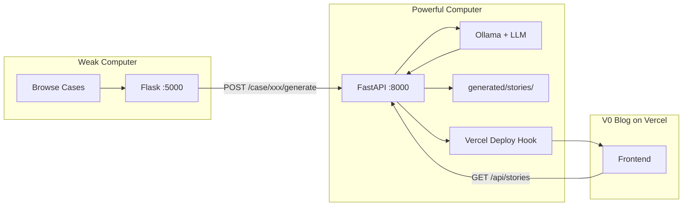

# Remote Legal Fiction Generator Setup

Split the workload so your weak computer runs the UI and commands, while your powerful computer runs the LLM and handles story generation + blog upload.

## Architecture



## Part 1: Powerful Computer Setup

1. **Clone/copy the project** to the powerful machine (or sync via git).

2. **Populate the database** with cases (same data as weak machine):

   ```bash
   python3 ingest_old_bailey.py --xml-dir data/oldbailey_xml/sessionsPapers --db old_bailey.db
   ```

   Or copy `old_bailey.db` from the weak machine.

3. **Install Ollama** and pull a model (you can use a larger one here):

   ```bash
   ollama serve
   ollama pull smollm2:360m   # or mistral:7b-instruct for better quality
   ```

4. **Configure deploy hook** in `.env` on the powerful machine:

   ```
   VERCEL_DEPLOY_HOOK_URL=https://api.vercel.com/v1/integrations/deploy/YOUR_HOOK_ID
   ```

   (Create the hook in Vercel: Settings → Git → Deploy Hooks. See [DEPLOY_HOOK_SETUP.md](DEPLOY_HOOK_SETUP.md).)

5. **Start FastAPI** bound to all interfaces (so the weak machine can reach it):

   ```bash
   uvicorn app.main:app --host 0.0.0.0 --port 8000
   ```

6. **Expose publicly for the blog** (if the V0 site fetches from your backend):

   - **Same LAN**: use the powerful machine's IP, e.g. `http://192.168.1.100:8000`
   - **Different networks**: run `ngrok http 8000` on the powerful machine and use the ngrok URL (e.g. `https://abc123.ngrok-free.app`)

## Part 2: Weak Computer Setup

1. **Run only Flask** (no FastAPI, no Ollama):

   ```bash
   GENERATE_BACKEND_URL=http://POWERFUL_IP:8000 ./run_flask_remote.sh
   ```

   Replace `POWERFUL_IP` with:

   - The powerful machine's LAN IP (e.g. `192.168.1.100`) if on the same network
   - The ngrok URL (e.g. `https://abc123.ngrok-free.app`) if remote

2. **Or use the convenience script** with default URL (edit the default in the script if needed):

   ```bash
   ./run_flask_remote.sh
   ```

   The default is `http://192.168.1.100:8000`. Override with:

   ```bash
   GENERATE_BACKEND_URL=https://your-ngrok-url.ngrok-free.app ./run_flask_remote.sh
   ```

## Part 3: Blog (V0) Configuration

The V0 frontend must fetch stories from the **powerful machine's** backend:

- Set `NEXT_PUBLIC_BACKEND_URL` in your Vercel project to the powerful machine's **public** URL (ngrok URL if the blog is hosted on Vercel and the powerful machine is at home).
- After each generation, the deploy hook triggers a Vercel rebuild. If the blog fetches `/api/stories` at runtime, it will get new stories on each visit. The deploy hook ensures the site rebuilds so any static/cached data is refreshed.

## Summary: Where Things Run

| Component                | Weak Computer         | Powerful Computer |
| ------------------------ | --------------------- | ----------------- |
| Flask (browse cases)     | Yes                   | No                |
| FastAPI (generate + API) | No                    | Yes               |
| Ollama (LLM)             | No                    | Yes               |
| old_bailey.db            | Optional (for ingest)  | Yes (required)    |
| oldbailey.sqlite         | Yes (for Flask)       | No                |
| generated/stories/       | No                    | Yes               |
| Deploy hook              | No                    | Yes               |

## Network Options

- **Same LAN**: Use `http://192.168.1.X:8000` as `GENERATE_BACKEND_URL` and `NEXT_PUBLIC_BACKEND_URL`. No ngrok needed if the blog is also on your LAN (unusual).
- **Blog on Vercel, powerful machine at home**: Run ngrok on the powerful machine so Vercel can reach `GET /api/stories`. Use the ngrok URL for both `GENERATE_BACKEND_URL` (weak → powerful) and `NEXT_PUBLIC_BACKEND_URL` (V0 → powerful).
- **Powerful machine in cloud**: Deploy FastAPI + Ollama to a cloud VM; use that VM's URL everywhere.
